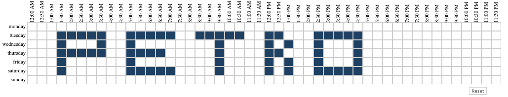
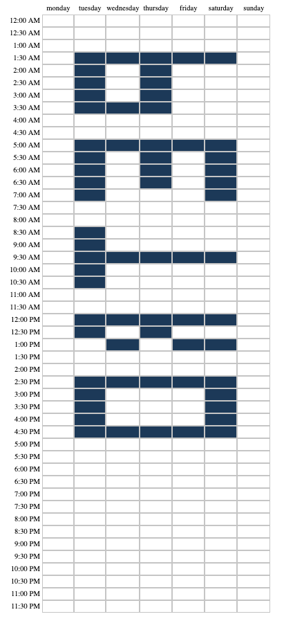

# Angular Dayparts

Angular directive for select hours in a week.


## Screenshots
Sample 1

Sample 2



## Usage
Include the module in your app

```javascript
angular.module('myapp', ['angular-dayparts'])
```


Configure the directive inside the controller

```javascript
$scope.options = {
    // Reset button
    reset: true, // default false
    
    // Event triggered when selecting a cell
    onChange: function(selected) {
        console.log('selected: ', selected)
    },
    
    // Prepopulated cells
    selected: ['monday-14', 'monday-15', 'monday-15.5'], // monday 2:00 pm, monday 3:00 pm, monday 3:30 pm
    
    // When true clicking on the day name it will select the entire row
    disableRowSelection: true, // default false
    
    // When true clicking on the hour it will select the entire columns
    disableColumnSelection: true // default false,

    // Reverses x and y axis so time goes from left to right and day goes top to bottom (i.e. sample1 is `reverse: true`) 
    reverse: true, // default false

    // adds "midnight" and "noon" labels to 12:00 am and 12:00 pm times.
    tweleveOClockLabel: true // default false
};
```


Call the directive from your page

```html
<angular-dayparts options="options"></angular-dayparts>
```

## Demo
Install dependencies:
`npm install`

Compile:
`gulp`

Run web server in at the root
example:
```
- cd angular-dayparts
- http-server
Starting up http-server, serving ./
Available on:
  http://127.0.0.1:8080
  http://localhost:8080
Hit CTRL-C to stop the server
```


## License

Released under the terms of MIT License.
